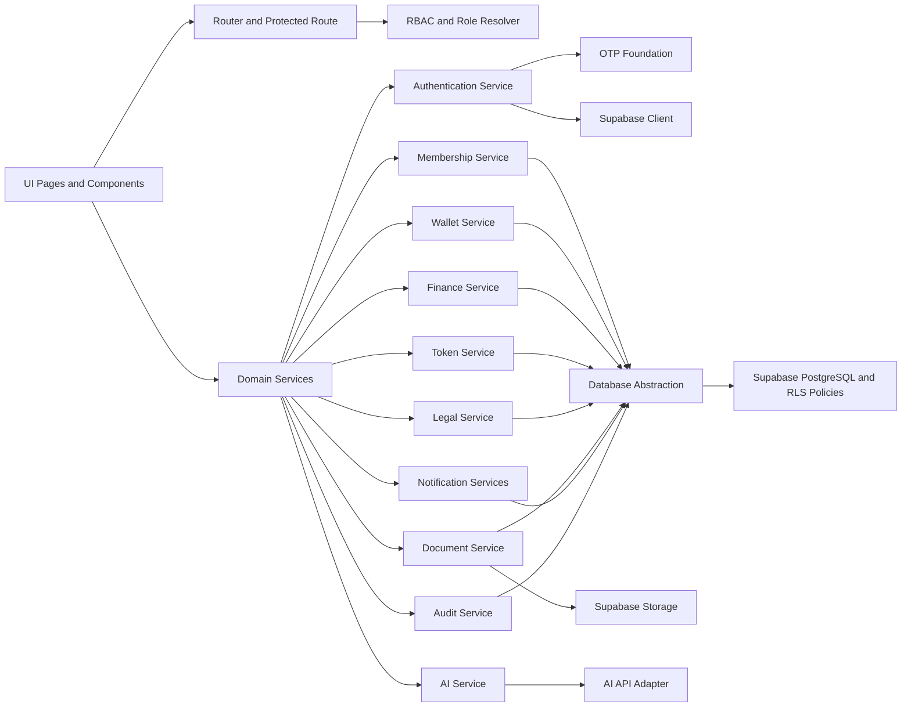

# ICJ Enterprise Platform - Enterprise Master Blueprint

Version: 1.0
Date: 2026-07-30
Owner: Chief Enterprise Architecture Office
Status: Production Blueprint (Implementation-Aligned + Target State)

## 1. Overall System Architecture

### 1.1 Architectural Style
- Architecture Pattern: Modular domain-driven enterprise web platform with clear domain service boundaries.
- Delivery Model: Frontend-first application with Supabase-backed data and auth foundation.
- Target Evolution: Transition from frontend service orchestration to backend API contract model with versioned domain APIs.

### 1.2 Layered Architecture
- Experience Layer: React pages, layouts, route guards, and module navigation.
- Application Layer: Domain services for membership, wallet, finance, legal, documents, AI, notification, and reporting.
- Access Control Layer: Role normalization, permission maps, and route-level authorization controls.
- Data Access Layer: Supabase client abstraction with local fallback behavior for non-production/degraded mode.
- Data Layer: PostgreSQL schema in Supabase with RLS and policy controls.
- Integration Layer: AI provider adapter abstraction, OTP/notification channel foundation, storage adapter.
- Governance Layer: Audit trails, policy controls, release checklist, and migration-based schema governance.

### 1.3 Runtime Contexts
- Strict Mode Context: Supabase enabled, mock auth disabled, environment-bound deployment settings.
- Fallback Context: Local storage-backed service continuity for development and non-prod simulation.

### 1.4 Architectural Principles
- Security-first identity and authorization at every boundary.
- Module isolation with explicit dependency contracts.
- Schema-first governance through migration versioning.
- Progressive hardening from feature completeness to operational resilience.
- Observability and auditability as first-class non-functional requirements.

## 2. Folder Structure

### 2.1 Current Repository Reality
- Primary Workspace contains active app tree, migrations, deployment artifacts, and service modules.
- Duplicate application subtree exists and creates governance ambiguity.

### 2.2 Canonical Production Structure (Target)

- /src
- /src/core
- /src/config
- /src/router
- /src/layouts
- /src/pages
- /src/components
- /src/contexts
- /src/hooks
- /src/services
- /src/services/auth
- /src/services/ai
- /src/data
- /src/theme
- /src/utils
- /supabase
- /supabase/migrations
- /scripts
- /public
- /docs
- /docs/architecture
- /docs/runbooks
- /docs/security

### 2.3 Governance Rules
- Exactly one canonical app root for build, lint, deploy, and CI.
- All schema changes must be migration-first in /supabase/migrations.
- All module services must remain domain-scoped and import through stable core boundaries.
- All new operational playbooks must be documented under /docs/runbooks.

## 3. Module Dependency Diagram

## 4. Database Architecture

### 4.1 Data Domains
- Identity and Profile Domain:
  - profiles
  - user_roles
  - role_categories
  - roles
  - permissions
  - role_permissions
- Core Business Domain:
  - members
  - wallets
  - tokens
  - donations
  - legal_cases
  - documents
  - notifications
  - reports
  - system_settings
- Token Extension Domain:
  - token_masters
  - token_transactions
  - token_allocations
  - token_wallet_links
  - token_reports
- Legal Extension Domain:
  - legal_clients
  - legal_courts
  - legal_advocates
  - legal_notices
  - legal_hearings
  - legal_timelines
  - legal_case_links
- Document Extension Domain:
  - document_categories
  - document_tags
  - document_versions
  - document_audit_logs
  - document_links
  - document_tag_map
- Auth and Channel Foundation Domain:
  - auth_audit_logs
  - auth_security_controls
  - auth_session_inventory
  - auth_channel_settings
  - otp_verification_requests
  - notification_channel_settings
  - notification_delivery_queue

### 4.2 Data Control Architecture
- RLS is enabled across core, token, legal, and document domains.
- Policies rely on authenticated role and JWT role claim guards.
- Profile identity normalization is enforced using trigger-based lifecycle controls.
- Enterprise identity generation is standardized through sequence and function-driven user_id format.

### 4.3 Database Hardening Roadmap
- Introduce stronger foreign-key rigor for extension linking tables.
- Add migration smoke tests and rollback verification in CI.
- Add encryption strategy for sensitive identity fields and retention controls.

## 5. Authentication Architecture

Purpose:
- Provide secure user registration, login, session lifecycle, profile bootstrap, and controlled OTP channel foundation.

Responsibilities:
- Registration payload validation and identity normalization.
- Login/logout/session restore and auth state event propagation.
- Registration and login anti-abuse controls (rate limits and lockouts).
- Adaptive risk scoring and security signal evaluation.
- Session inventory tracking for all active sessions.
- User self-session revocation and logout-all-other-devices controls.
- Administrator global session revoke controls.
- Trusted-device registry and trust lifecycle management.
- User and administrator trusted-device revocation workflows.
- Optional remote logout cascade for revoked devices.
- Role normalization and profile enrichment.
- OTP channel dispatch and verification orchestration (currently provider placeholders).
- Authentication event audit logging.

Database Tables:
- profiles
- auth_audit_logs
- auth_security_controls
- auth_session_inventory
- auth_trusted_devices
- auth_channel_settings
- otp_verification_requests

APIs:
- Current Internal Service APIs:
  - register
  - login
  - logout
  - getCurrentUser
  - isLoggedIn
  - getProfile
  - updateProfile
  - sendMobileOTP
  - sendWhatsAppOTP
  - verifyMobileOTP
  - sendEmailOTP
  - changePassword
  - getSession
  - getLockedAccounts
  - unlockLockedAccount
  - getMySessions
  - getActiveSessionsForAdmin
  - revokeOwnSession
  - revokeOtherSessions
  - revokeSessionAsAdmin
  - getMyTrustedDevices
  - getTrustedDevicesForAdmin
  - revokeOwnTrustedDevice
  - revokeTrustedDeviceAsAdmin
- Target External APIs:
  - POST /api/v1/auth/register
  - POST /api/v1/auth/login
  - POST /api/v1/auth/logout
  - POST /api/v1/auth/password/change
  - POST /api/v1/auth/password/forgot
  - POST /api/v1/auth/password/reset
  - POST /api/v1/auth/otp/request
  - POST /api/v1/auth/otp/verify
  - GET /api/v1/auth/session

Services:
- authService
- auth/registrationValidation
- auth/otpService
- auditLogService
- supabase

UI Pages:
- Login
- Register
- Profile

Dependencies:
- Supabase Auth
- Profile trigger and user ID generator in database
- AuthContext
- ProtectedRoute
- Role resolver and route access map

Security Considerations:
- Enforce strict password policy and input normalization.
- Enforce configurable registration/login rate limits and lockout controls.
- Enforce brute-force detection and administrator unlock workflows.
- Maintain adaptive risk scoring with optional risk-blocking enforcement.
- Enforce RBAC checks for session inventory read/revoke operations.
- Persist session lifecycle telemetry for incident response and forensics.
- Enforce RBAC checks for trusted-device inventory and revoke operations.
- Persist trusted-device lifecycle telemetry for incident response and device hygiene.
- Introduce forgot-password and account recovery token lifecycle controls.
- Enable provider-backed OTP only after compliance gating and observability readiness.

## 6. Role and Permission Architecture

Purpose:
- Govern access to modules, routes, and actions through enterprise role and permission controls.

Responsibilities:
- Role catalog normalization and legacy-role mapping.
- Module permission catalog ownership.
- Route access enforcement in guarded navigation.
- Role assignment foundation with user_roles mapping.

Database Tables:
- role_categories
- roles
- permissions
- role_permissions
- user_roles
- profiles (role_code, role_category, legacy_role)

APIs:
- Current Internal Service APIs:
  - normalizeRoleCode
  - resolveRoleCode
  - getRolePermissions
  - hasPermission
  - hasRouteAccess
  - getPostLoginRoute
- Target External APIs:
  - GET /api/v1/rbac/roles
  - GET /api/v1/rbac/permissions
  - GET /api/v1/rbac/users/{userId}/roles
  - PUT /api/v1/rbac/users/{userId}/roles
  - POST /api/v1/rbac/roles/{roleId}/permissions

Services:
- core/roles
- core/permissions
- core/rbac
- adminService (interim role update pattern)

UI Pages:
- Administration
- Settings

Dependencies:
- Authentication role context
- Route guard pipeline
- Database RLS policy model

Security Considerations:
- Shift from route-only control to action-level policy enforcement in every domain service.
- Enforce separation of duties for role assignment updates.
- Add approval workflow for high-privilege role grants.

## 7. Membership Architecture

Purpose:
- Manage member lifecycle, identity profile metadata, KYC-adjacent data, and member-level operational history.

Responsibilities:
- Member CRUD and profile enrichment.
- Member document attachments and history timeline.
- Member-level status, verification state, and identity linkage.

Database Tables:
- members
- profiles
- documents (cross-reference)

APIs:
- Current Internal Service APIs:
  - getAll
  - create
  - update
  - remove
  - getById
  - getHistory
  - addHistory
  - getDocuments
  - addDocument
  - removeDocument
- Target External APIs:
  - GET /api/v1/members
  - POST /api/v1/members
  - GET /api/v1/members/{memberId}
  - PUT /api/v1/members/{memberId}
  - DELETE /api/v1/members/{memberId}
  - GET /api/v1/members/{memberId}/history
  - GET /api/v1/members/{memberId}/documents

Services:
- memberService
- database

UI Pages:
- Membership
- Members
- MemberRegistration
- MemberDirectory
- MemberVerification
- MemberDocuments
- MemberKYC
- MemberIdentity
- MemberCertificates
- MemberHistory
- MemberActivity
- MemberSettings
- MemberCard
- MemberProfile

Dependencies:
- Authentication context and role mapping
- Document management for attachments
- Wallet and token balances for financial identity context

Security Considerations:
- Add strict Aadhaar/PAN validation and masking rules.
- Restrict sensitive fields by permission and purpose scope.
- Add verifier workflows for KYC decisions and immutable decision audit events.

## 8. Wallet Architecture

Purpose:
- Maintain member wallet records and balances for operational and finance-linked transactions.

Responsibilities:
- Wallet creation and lifecycle management.
- Balance update orchestration through finance and token operations.
- Member-wallet linkage governance.

Database Tables:
- wallets
- members
- token_wallet_links

APIs:
- Current Internal Service APIs:
  - getAll
  - create
  - update
  - remove
- Target External APIs:
  - GET /api/v1/wallets
  - POST /api/v1/wallets
  - GET /api/v1/wallets/{walletId}
  - PUT /api/v1/wallets/{walletId}
  - POST /api/v1/wallets/{walletId}/credit
  - POST /api/v1/wallets/{walletId}/debit
  - POST /api/v1/wallets/{walletId}/transfer

Services:
- walletService
- database
- financeService (wallet ledger impact)
- tokenService (unit value and redemption impact)

UI Pages:
- Wallet
- MemberWallet

Dependencies:
- Membership for owner identity linkage
- Finance ledger for accounting trace
- Token service for cross-asset operations

Security Considerations:
- Require maker-checker controls for high-value transfers.
- Add idempotency keys for transaction postings.
- Add anomaly alerts for rapid debit/credit cycles.

## 9. Finance Architecture

Purpose:
- Provide accounting entries, wallet-ledger postings, vouchers, donation-linked records, and reporting views.

Responsibilities:
- Finance ledger operations for income, expense, receipt, and payment.
- Wallet transaction postings and voucher generation.
- Account head governance and transaction history export.

Database Tables:
- donations
- wallets
- reports
- tokens
- token_transactions
- token_reports

APIs:
- Current Internal Service APIs:
  - getAccountHeads
  - createAccountHead
  - updateAccountHead
  - removeAccountHead
  - getFinanceEntries
  - getWalletLedger
  - createWalletEntry
  - createFinanceEntry
  - deleteEntry
  - getVouchers
  - getBooks
  - getTransactionHistory
  - getOverview
- Target External APIs:
  - GET /api/v1/finance/ledger
  - POST /api/v1/finance/entries
  - GET /api/v1/finance/vouchers
  - POST /api/v1/finance/vouchers
  - GET /api/v1/finance/overview
  - GET /api/v1/finance/reports

Services:
- financeService
- donationService
- tokenService
- walletService

UI Pages:
- Finance
- Donations
- Transactions
- Reports

Dependencies:
- Wallet domain for balance effects
- Token domain for linked asset accounting
- Membership for member-linked financial ownership

Security Considerations:
- Add dual-control approvals for outbound financial actions.
- Add reconciliation jobs and exception workflow.
- Add signed export controls for regulated reporting.

## 10. Legal Management Architecture

Purpose:
- Manage legal cases, clients, hearings, notices, timelines, and cross-domain references.

Responsibilities:
- Legal case lifecycle and metadata management.
- Hearing and notice planning.
- Case timeline and linked evidence/document references.
- Cross-linking with finance and token references.

Database Tables:
- legal_cases
- legal_clients
- legal_courts
- legal_advocates
- legal_notices
- legal_hearings
- legal_timelines
- legal_case_links

APIs:
- Current Internal Service APIs:
  - getAll
  - getClients
  - addClient
  - getCourts
  - addCourt
  - getAdvocates
  - addAdvocate
  - getNotices
  - addNotice
  - getHearings
  - addHearing
  - getCaseTimeline
  - addTimelineEntry
  - getCaseLinks
  - linkDocuments
  - createFinanceTokenLinks
  - searchCases
  - getDashboard
  - getReports
  - create
  - update
  - remove
- Target External APIs:
  - GET /api/v1/legal/cases
  - POST /api/v1/legal/cases
  - GET /api/v1/legal/cases/{caseId}
  - PUT /api/v1/legal/cases/{caseId}
  - GET /api/v1/legal/cases/{caseId}/timeline
  - POST /api/v1/legal/cases/{caseId}/notices
  - POST /api/v1/legal/cases/{caseId}/hearings
  - POST /api/v1/legal/cases/{caseId}/documents

Services:
- legalService
- database
- financeService
- tokenService
- documentService

UI Pages:
- LegalCases

Dependencies:
- Document management for evidence and case attachments
- Membership for client/member linkage
- Finance and token for case-related monetary trails

Security Considerations:
- Add legal hold and chain-of-custody markers for case artifacts.
- Apply field-level privacy controls for personally sensitive litigant data.
- Add immutable timeline event signatures for evidentiary integrity.

## 11. Document Management Architecture

Purpose:
- Provide enterprise document vault capabilities with category/tagging, versioning, linking, and auditability.

Responsibilities:
- Upload, search, metadata enrichment, and retrieval.
- Version management and document activity logging.
- Cross-module linkages to membership, legal, finance, and token contexts.

Database Tables:
- documents
- document_categories
- document_tags
- document_versions
- document_audit_logs
- document_links
- document_tag_map

APIs:
- Current Internal Service APIs:
  - getCategories
  - addCategory
  - getAll
  - search
  - getDashboard
  - getIntegrationSources
  - create
  - update
  - remove
  - addVersion
  - getVersions
  - getAuditLog
  - getTags
  - markPreview
  - getDownloadUrl
  - getPreviewUrl
- Target External APIs:
  - GET /api/v1/documents
  - POST /api/v1/documents
  - GET /api/v1/documents/{documentId}
  - PUT /api/v1/documents/{documentId}
  - DELETE /api/v1/documents/{documentId}
  - POST /api/v1/documents/{documentId}/versions
  - GET /api/v1/documents/{documentId}/audit
  - POST /api/v1/documents/{documentId}/links

Services:
- documentService
- database
- supabase storage adapter
- memberService
- legalService
- financeService
- tokenService

UI Pages:
- Documents
- MemberDocuments

Dependencies:
- Supabase storage bucket strategy
- Cross-domain source references
- Role-based permission controls for download and deletion

Security Considerations:
- Add data retention classes and legal hold enforcement.
- Add malware scanning and MIME/content verification on upload.
- Add encrypted-at-rest plus signed URL expiry and access logging.

## 12. AI Architecture

Purpose:
- Provide controlled AI foundation capabilities across modules with governance-first execution controls.

Responsibilities:
- AI configuration management and feature flag governance.
- Module registration and role-aware AI permissions.
- Prompt template lifecycle and request history tracking.
- Provider adapter abstraction and error handling.

Database Tables:
- Current State: local storage-based AI state.
- Target State:
  - ai_configurations
  - ai_feature_flags
  - ai_prompt_templates
  - ai_request_history
  - ai_audit_logs

APIs:
- Current Internal Service APIs:
  - getConfiguration
  - saveConfiguration
  - getFeatureFlags
  - setFeatureFlag
  - getPermissions
  - getModules
  - updateModule
  - getPrompts
  - createPrompt
  - updatePrompt
  - removePrompt
  - getLogs
  - getRequestHistory
  - getFoundationStatus
  - request
  - ask
- Target External APIs:
  - GET /api/v1/ai/config
  - PUT /api/v1/ai/config
  - GET /api/v1/ai/modules
  - POST /api/v1/ai/request
  - GET /api/v1/ai/requests
  - GET /api/v1/ai/audit

Services:
- aiService
- ai/aiConfiguration
- ai/aiFeatureFlags
- ai/aiPermissionService
- ai/aiModuleRegistry
- ai/aiPromptManager
- ai/aiApiAdapter
- ai/aiLogger
- ai/aiRequestHistory

UI Pages:
- AIAssistant
- Dashboard (AI status panel)

Dependencies:
- Role and permission architecture
- Audit architecture for usage traceability
- Provider adapter and policy controls

Security Considerations:
- Keep external model calls disabled by default until governance approval.
- Add prompt/content policy filters and data loss prevention guardrails.
- Add strict per-module authorization before AI context injection.

## 13. Notification Architecture

Purpose:
- Enable in-app and multi-channel notification orchestration through policy-driven channel control.

Responsibilities:
- Notification creation, read-state tracking, and deletion.
- Channel enablement governance by environment flags and DB settings.
- Queue foundation for deferred delivery workers.

Database Tables:
- notifications
- notification_channel_settings
- notification_delivery_queue

APIs:
- Current Internal Service APIs:
  - getAll
  - create
  - markAsRead
  - remove
  - getChannelConfig
  - isChannelEnabled
  - dispatch
- Target External APIs:
  - GET /api/v1/notifications
  - POST /api/v1/notifications
  - PATCH /api/v1/notifications/{notificationId}/read
  - POST /api/v1/notifications/dispatch
  - GET /api/v1/notifications/queue

Services:
- notificationService
- notificationFoundationService
- database

UI Pages:
- Notifications

Dependencies:
- Auth profile targeting
- Channel setting controls
- Queue worker architecture (future)

Security Considerations:
- Add provider-level secret isolation and rotation policies.
- Add anti-spam throttling and retry backoff policies.
- Add per-channel compliance templates and delivery audit trail.

## 14. Audit Architecture

Purpose:
- Provide immutable operational traceability for identity, admin actions, and domain events.

Responsibilities:
- Auth event logging with metadata.
- Domain-level event capture and retrieval for governance review.
- Correlation support for incident analysis.

Database Tables:
- auth_audit_logs
- document_audit_logs
- notification_delivery_queue (delivery state audit value)
- Target Additions:
  - platform_audit_events
  - audit_event_stream_offsets

APIs:
- Current Internal Service APIs:
  - logAuthEvent
- Target External APIs:
  - GET /api/v1/audit/events
  - GET /api/v1/audit/events/{eventId}
  - POST /api/v1/audit/query
  - GET /api/v1/audit/exports

Services:
- auditLogService
- documentService (document-level audit writes)
- adminService (interim admin audit cache)

UI Pages:
- ActivityLog
- Administration

Dependencies:
- Authentication and role context
- All domain services as event producers

Security Considerations:
- Enforce append-only event store semantics.
- Sign high-value events and preserve hash chains for tamper evidence.
- Restrict audit query access with least privilege and redaction filters.

## 15. Security Architecture

Purpose:
- Establish defense-in-depth across identity, authorization, data protection, transport, and operational controls.

Responsibilities:
- Password policy and credential hygiene controls.
- Input validation and data normalization.
- RLS policy enforcement and role-claim-based data access.
- Sensitive data handling controls for KYC and identity fields.

Database Tables:
- profiles
- auth_audit_logs
- otp_verification_requests
- user_roles
- role_permissions
- notification_delivery_queue

APIs:
- Current Internal Service APIs:
  - registrationValidation utilities
  - role and permission checks
  - route guard checks
- Target External APIs:
  - POST /api/v1/security/risk/evaluate
  - POST /api/v1/security/sessions/revoke
  - POST /api/v1/security/device/trust
  - GET /api/v1/security/audit/posture

Services:
- auth/registrationValidation
- authService
- core/rbac
- core/permissions
- auditLogService

UI Pages:
- Login
- Register
- Profile
- Administration

Dependencies:
- Supabase auth and JWT claims
- RLS policies across all business domains
- Deployment environment control plane

Security Considerations:
- Introduce brute-force lockout and adaptive risk scoring.
- Introduce device inventory and trusted-device revocation lifecycle.
- Add field-level encryption strategy for Aadhaar/PAN and key management policy.

## 16. API Architecture

Purpose:
- Standardize service contracts through a versioned API layer for maintainability, security, and external integration.

Responsibilities:
- Define domain API boundaries and versioning policy.
- Enforce request validation, authn/authz middleware, and response schemas.
- Provide OpenAPI contract and lifecycle governance.

Database Tables:
- No dedicated API metadata tables currently.
- Target Additions:
  - api_clients
  - api_keys
  - api_rate_limits
  - api_request_logs

APIs:
- Current Internal Service APIs:
  - Frontend domain services under src/services as de facto API boundary.
- Target External APIs:
  - /api/v1/auth/*
  - /api/v1/members/*
  - /api/v1/wallets/*
  - /api/v1/finance/*
  - /api/v1/legal/*
  - /api/v1/documents/*
  - /api/v1/ai/*
  - /api/v1/notifications/*
  - /api/v1/audit/*

Services:
- Current: frontend service layer + Supabase SDK.
- Target: API gateway, domain API services, contract validation middleware.

UI Pages:
- All module pages consume this layer indirectly through service modules.

Dependencies:
- Authentication architecture for JWT and session trust.
- RBAC architecture for policy enforcement.
- Audit architecture for API event telemetry.

Security Considerations:
- Enforce gateway rate limits, WAF rules, and abuse controls.
- Apply request signing for high-risk operations.
- Enforce schema validation and strict error redaction.

## 17. Deployment Architecture

Purpose:
- Deliver predictable, secure, and repeatable releases across staging and production environments.

Responsibilities:
- Environment configuration and secret injection.
- Build, lint, bundle, and artifact publication.
- Migration execution and verification.
- Runtime route rewrites and static asset delivery.

Database Tables:
- Deployment is infrastructure-centric; no dedicated deployment tables in current state.
- Target Additions:
  - deployment_runs
  - migration_run_logs
  - release_artifacts

APIs:
- Current Internal Deployment Interfaces:
  - npm scripts: dev, build, lint, preview
  - migration execution via Supabase CLI pipeline
- Target External/Operational APIs:
  - CI pipeline webhook triggers
  - deployment event ingestion endpoint

Services:
- vite build pipeline
- environment configuration service model
- Supabase migration pipeline

UI Pages:
- No dedicated deployment UI currently.
- Target: internal release dashboard under Administration.

Dependencies:
- Vite base path and router basename compatibility.
- Supabase connectivity and environment variables.
- Hosting rewrite rules for SPA deep-link resilience.

Security Considerations:
- Enforce environment isolation with non-shared keys.
- Disable mock auth and enforce strict auth mode outside local development.
- Add signed artifact provenance and SBOM generation in CI.

## Enterprise Implementation Priorities

### Priority 1: Identity and Security Hardening
- Implement forgot-password, forgot-user-id, and account recovery workflows.
- Add lockout, throttling, and risk scoring controls.
- Add device and session inventory with admin revoke capabilities.

### Priority 2: API and Governance Stabilization
- Introduce versioned backend API layer and OpenAPI governance.
- Centralize action-level permission enforcement in all domain services.
- Establish unified platform audit event model.

### Priority 3: Compliance and Operational Maturity
- Implement Aadhaar/PAN masking, validation, and restricted access controls.
- Implement document retention and legal hold lifecycle.
- Add migration smoke tests, CI gates, and rollback safety checks.

### Priority 4: Productionization of Foundation Channels
- Keep OTP and outbound notification channels disabled by default.
- Introduce queue workers, provider adapters, retry policies, and observability.

## Blueprint Acceptance Criteria

- Every domain has explicit purpose, responsibility, data ownership, API contract, and service ownership.
- All high-risk workflows are auditable and policy-enforced.
- Security controls are layered across UI, service, API, and database boundaries.
- Deployment process is deterministic, test-gated, and environment-governed.
- Architecture supports growth into full enterprise API-driven platform model.
